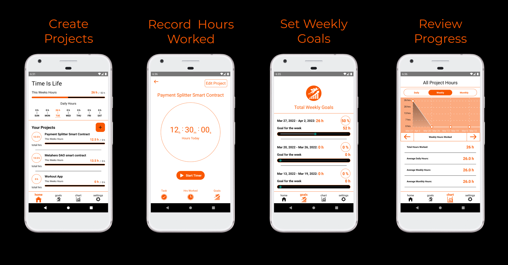

# LavaLamp NFTs

7979 LavaLamp SVGs generated by Javascript code, stored on IPFS. Bringing Nostalgia back to the blockchain.

<p align="center">
  
</p>

# Goal / Purpose

Google Calendar has nothing on this time management app. Instead of using google calendar, I decided to manage my life by setting a weekly goal of how many hours I want to work each week and than hit it. With my app you create a project, set a goal and record hours worked. With the calendar feature you can review your progress with greater detail than google calendar. Time is Life.

# Tech Stack
- React Native
- Realm DB
- Designed using Figma and Sketch
- Hope you enjoy it!!!

# Future Plans
The first goal is integrate with mongoDB so that I can store the data online and back it up. The next goal is to integrate the app with the blockchain and create an  accountability systems, maybe some sort of DAO like structure. My current vision is linking the app to a smart contract that sends money to wallets of my choice, could be charities or accountability buddies.

<!--
# Getting Started / Running the App

First, run the development server:

```bash
npm run start
# or
yarn start
```

This project was bootstrapped with [Create React App](https://github.com/facebook/create-react-app).
-->
